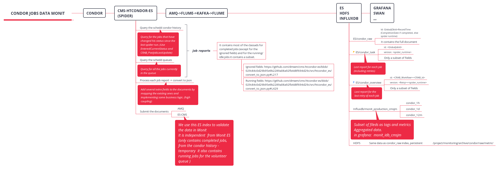

# CPU Efficiency script

We use condor data in HDFS to generate statistics about data use in cpu efficiency for workflows//request. We use the following attributes from the condor documents for completed jobs: 

- GlobalJobId  - To identify the unique jobs
- Workflow - Because we want to group by workflow
- WMAgent_RequestName - Because for production jobs we want to group by request
- ScheddName - Used to generate the log links
- WMAgent_JobID - Used to generate the log links
- RecordTime -  To filter the job reports and to get the earliest and latest use date for a given datablock
- JobFailed -  To take into account successful jobs only
- Status - To take into account only completed jobs
- Site - To have details by site
- Type -  To filter by CMS job type
- WallClockHr - Used to calculate the CPU efficiency
- CpuTimeHr - Used to calculate the CPU efficiency
- RequestCpus - Used to calculate the CPU efficiency

And produce a web site with CPU efficiency by workflow or request (according to the selected cms type) for the requests/workflows matching the selected range. 

## Some context

The condor monitoring data provides information at job level for all the tasks running in the infrastructure. 


The json documents have a flexible schema and currently they have more than 1000 different fields. We also have more than 300GB/day in data (Monit has a compaction method, so data older than a day is deduplicated and compressed, making the data weight around 80GB/day). 

## How to run it

You can run the python script directly, but it will require that you setup the environment first. The run_condor_cpu_efficiency.sh script will setup the environment in a lxplus-like machine and will run the python script. 

```bash
Usage: run_condor_cpu_efficiency.sh [OPTIONS]


Options:
  --start_date [%Y/%m/%d|%Y-%m-%d|%Y%m%d]
  --end_date [%Y/%m/%d|%Y-%m-%d|%Y%m%d]
  --cms_type [analysis|production|folding@home|test]
                                  Workflow type to query 
  --min_eff INTEGER               Minimum efficiency to be included in the
                                  report
  --max_eff INTEGER               Max efficiency to be included in the report
  --output_folder TEXT            local output directory
  --help                          Show this message and exit.
```

The default time period will be the last 30 days; the default efficiency range is (5, 70); the default type is production; and the default output folder will be `./www/cpu_eff`

E.g. 

```bash
run_condor_cpu_efficiency.sh --start_date 20200507 --end_date 20200407
```

This will generate a web site at `./www/cpu_eff` with a main page called `CPU_Efficiency_Table.html` and a folder (`wfbysite` ) with a folder by workflow with a file by request with details by site (because production jobs will have grouping by request). 

## Requirements

This script uses Condor data from  `analytix` cluster. They should be available at `/project/monitoring/archive/condor/raw/metric/`

### How to run the script without LCG release environment

This instructions are not necessary in a lxplus-like environment.

All python packages are already available at the [LCG release]( http://lcginfo.cern.ch/release/96python3/ ). If you want to run it without an LCG environment, you will need this python 3 and this packages:

- pandas
- pyspark (2.4.x)
- click

And you will need to setup the [environment for hadoop]( https://cern.service-now.com/service-portal/article.do?n=KB0004426 ). 

