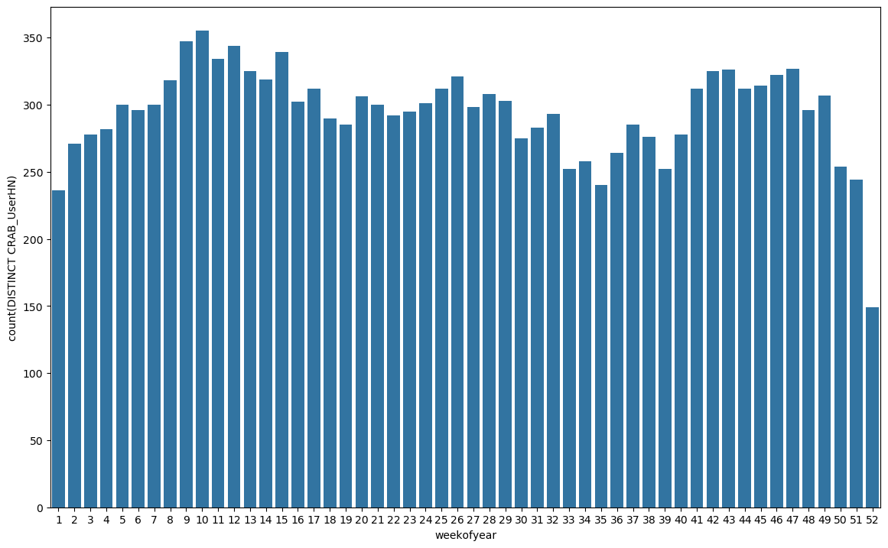

# HDFS CRAB Unique Users Script

We use condor data in HDFS to generate a unique users dataset/plot about CRAB in T2 non-CERN sites. We use the following attributes from the condor documents for completed jobs: 

- GlobalJobId - To identify the unique jobs
- RecordTime - To filter the job reports and to get the earliest and latest use date for a given datablock
- Status - To filter for only the completed/removed jobs
- CRAB_UsernHN - To identify the user.
- Site - To filter for T2 sites which are not from CERN. 

And produce a dataset with: 

- year
- month/weekofyear: aggregation period.
- count(DISTINCT CRAB_UserHN)

## How to run it

You can run the python script directly, but it will require that you setup the environment first. The `run_crab_unique_users.sh` script will setup the environment in a lxplus-like machine and will run the python script. 

```
Usage: condor_crab_unique_users.py [OPTIONS] [%Y/%m/%d|%Y-%m-%d|%Y%m%d]
                                   [%Y/%m/%d|%Y-%m-%d|%Y%m%d]

  This script will generate a dataset with the number of unique users of
  CRAB either by month or by weekofyear.

Options:
  --by [weekofyear|month]  Either weekofyear or month
  --generate_plots         Additional to the csv, generate the plot(s)
  --output_folder TEXT     local output directory
  --help                   Show this message and exit.
```

E.g. 

```bash
/bin/bash bin/run_crab_unique_users.sh --generate_plots --output_folder "./output" "2019-01-01" "2020-01-01" --by weekofyear
```

This will generate a csv file `UniqueUsersBy_weekofyear_20190101-20200101.csv` and a png file `UniqueUsersBy_weekofyear_20190101-20200101.png` with the number of unique CRAB users for each week of the year for CRAB users in T2 non CERN sites. 

 


## Requirements

This script uses Condor data from  `analytix` cluster. They should be available at `/project/monitoring/archive/condor/raw/metric/`

### How to run the script without LCG release environment

This instructions are not necessary in a lxplus-like environment.

All python packages are already available at the [LCG release]( http://lcginfo.cern.ch/release/96python3/ ). If you want to run it without an LCG environment, you will need this python 3 and this packages:

- pandas
- pyspark (2.4.x)
- matplotlib
- seaborn
- click

And you will need to setup the [environment for hadoop]( https://cern.service-now.com/service-portal/article.do?n=KB0004426 ). 

