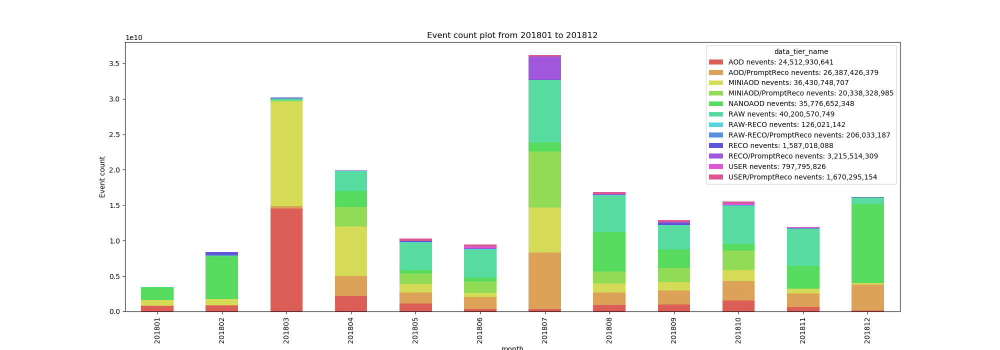

# Event Count Plots

To produce the event count plots without querying the DBS API, we created a spark application that replicates part of the functionality of [tierstats]( https://github.com/vkuznet/tierstats ) using the DBS dumps in HDFS. 

The result is an application that produces the event count by tier/month plot for a year in a fraction of the time it took to create it before (when it was necessary to run `tierstats` month by month and produce the plots externally), without imposing load to the DBS server. 

## How to install

The event count plot application is part of [CMSSpark]( https://github.com/dmwm/CMSSpark ). Just install or update the CMSSpark python package or clone the repository and add `CMSSpark/src/python` to the python path.

## How to create the Event Count Plots

In a LXPLUS-like environment, you can use the  [generate_event_count_plot.sh](../../bin/generate_event_count_plot.sh) script, which will take care of set up the environment and execute the python script. Any parameter you pass to this script will be pass to the python script. 

Valid parameters:

```bash
  -h, --help            show this help message and exit
  --start_month START_MONTH
                        Start month in format yyyy/MM, defaults to: end_month
                        - 11 months (i.e. one year period)
  --end_month END_MONTH
                        End month (inclusive) in format yyyy/MM, defaults to
                        previous month
  --output_folder OUTPUT_FOLDER
                        output folder for the plots (default ./output)
  --output_format {pdf,png,jpg,svg}
                        output format for the plots (default png)
  --tiers [TIERS [TIERS ...]]
                        Space separed list of tiers to consider. ex: GEN GEN-
                        SIM GEN-RAW GEN-SIM-RECO AODSIM MINIAODSIM RAWAODSIM
                        NANOAODSIM GEN-SIM-DIGI-RAW GEN-SIM-RAW GEN-SIM-DIGI-
                        RECO
  --remove [REMOVE [REMOVE ...]]
                        Space separed list of case insensitive patterns. The
                        datasets which name match any of the patterns will be
                        ignored.
  --skims [SKIMS [SKIMS ...]]
                        Space separed list of skims. The skims are case
                        sensitive. Datasets which match the given skims will
                        not be counted as part of the tier, but in a separated
                        group named <tier>/<skim>.
  --generate_csv        Create also a csv file with the plot data
  --only_valid_files    Only consider valid files, default False
  --verbose             Prints additional logging info
```

Example:

```bash
bin/generate_event_count_plot.sh --tiers "RAW" "RECO" "AOD" "RAW-RECO" "USER" "MINIAOD" "NANOAOD" --skims "PromptReco" "Parking" --remove "test" "backfill" "StoreResults" "monitor" "Error/" "Scouting" "MiniDaq" "/Alca" "L1Accept" "L1EG" "L1Jet" "L1Mu" "PhysicsDST" "VdM" "/Hcal" "express" "Interfill" "Bunnies" "REPLAY" "LogError" --end_month "2018/12"
```

This will create an event count plot for [2018/01/01, 2018/12/31] for the given tiers, excluding datasets which match the remove patterns and considering apart the datasets that match the skims patterns.  

  

### cronjob (acronjob)

The [cron_genCRSGplots.sh](../../bin/cron_genCRSGplots.sh) have been created to generate the yearly plots. It will accept two positional parameters, the base output folder and the image output format. Any additional parameter will be added to the python script call. 

To add it as a `acron` job you need to run `acrontab -e` and add an entry like this:

```
00 14 05 * * lxplus.cern.ch /bin/bash /full/path/CMSSpark/bin/cron_genCRSGplots.sh /full/path/of/output/folder
```

to run the day 05 of every month at 14:00, to generate the rolling year plot up to the previous month. For more information about `acron`, you can go to [ACRON service page]( http://information-technology.web.cern.ch/services/ACRON-Service ).

This script will generate two plots, with the following parameters.

|                 | FIG 9                                                        | FIG 10                                                       |
| --------------- | ------------------------------------------------------------ | ------------------------------------------------------------ |
| Tiers           | "GEN" "GEN-SIM" "GEN-RAW" "GEN-SIM-RECO" "AODSIM" "MINIAODSIM" "RAWAODSIM" "NANOAODSIM" "GEN-SIM-DIGI-RAW" "GEN-SIM-RAW" "GEN-SIM-DIGI-RECO" | "RAW" "RECO" "AOD" "RAW-RECO" "USER" "MINIAOD" "NANOAOD"     |
| Skims           | *DEFAULT*                                                    | "PromptReco" "Parking"                                       |
| Remove Patterns | *DEFAULT*                                                    | "test" "backfill" "StoreResults" "monitor" "Error/" "Scouting" "MiniDaq" "/Alca" "L1Accept" "L1EG" "L1Jet" "L1Mu" "PhysicsDST" "VdM" "/Hcal" "express" "Interfill" "Bunnies" "REPLAY" "LogError" |

